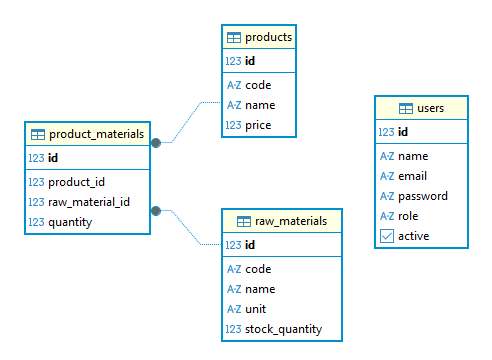

# DATABASE — Autoflex Inventory System

## 1) Objetivo

Este documento descreve o modelo de dados relacional utilizado no sistema Autoflex Inventory, incluindo:

- Estrutura das tabelas
- Relacionamentos
- Estratégia de modelagem
- Decisões técnicas relacionadas ao banco

---

## 2) Modelo Entidade-Relacionamento

O sistema é composto pelas seguintes entidades principais:

- users
- products
- raw_materials
- product_materials

### Relacionamentos

- Um **produto** pode utilizar várias matérias-primas.
- Uma **matéria-prima** pode ser utilizada por vários produtos.
- Essa relação é modelada através da tabela intermediária `product_materials`.

---

## 3) Diagrama Simplificado



## 4) Estratégia de Versionamento do Banco

O banco de dados é controlado por **Flyway**.

- Todas as alterações estruturais são feitas por migrations.
- Migrations ficam em:
  `src/main/resources/db/migration`
- Nunca são editadas após execução.
- Alterações futuras são feitas criando novas versões (V2, V3, V4...).

O Hibernate está configurado com:

```
ddl-auto: validate
```

Ou seja:

- O Flyway cria e altera o schema.
- O Hibernate apenas valida a consistência.
